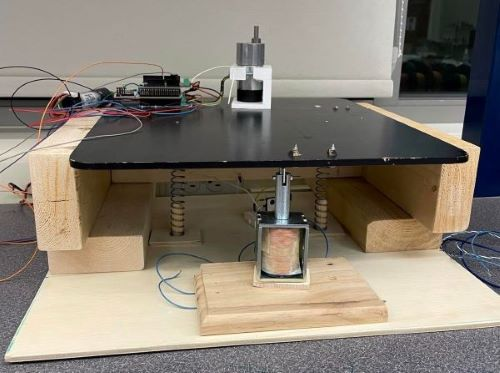

# Pen Plotter Term Project
## **Description of Project**
Our proposed system is a 2.5 axis system that will act as a pen plotter. Our proposed system is similar to the example idea where the arm rotates radially, however it is driven by the hub instead of driven by the wheel. The wheel will freely rotate about a curved platform and provide stability for the arm. The motor will be geared up to increase the precision of the radial position. Our radial movement will be controlled using a timing belt along with two timing belt driver pulleys. Our other motor will drive one of the pulleys, causing the belt to move outwards or inwards radially. The pen holder will be attached to the bottom side of the belt and will not contain the solenoid, only a mechanism to hold the pen. 

Instead of dropping the pen to write, we will be raising the edge of the platform using a solenoid placed at the far edge of the paper holder. The paper holder will be attached to a hinge that allows it to rotate out of reach of the pen. 

## **Hardware Design**
Our Hardware Design is broken up into three parts: the drop down table base, the track, and the sled. The drop down table base allows us to have a half degree of freedom by being in up(pen down) or in the down position (pen up). We used a 12V continuous pull solenoid, actuated with an N-channel Mosfet with a 5V Gate to Source start voltage. This in conjuction with a flyback diode, and two 4 inch springs, allowed for our drawing surface to be dropped and not be in contact with the pen. The sled was the mover of the pen. Two 3D printed side rails created a track for our pen holder. The pen holder moved along this track being guided by 6mm GT2 timing belt that was directly mounted to the holder. The belt was driven by a 48 tooth plastic gear that was geared to the provided ME 405 bin Pittperson Gearmotors. The side rails were epoxied to a 4"x13"x0.375" piece of particle board with a slot cut through the middle of it. The conjunction of the drop down table base and the sled were through the "elbow motor". The "elbow motor" was a 131:1 12V DC motor that was clamped down to a 3D printed motor mount. This motor mount was epoxied to the top of the drop down table ledge, and the nucleo is mounted next to it. The elbow motor shaft ran through the particle board sled, and interfaced with a shaft collar epoxied to the surface. In order to allow free motion of the sled across the drawing plane, a caster wheel was epoxied to the end of the sled, opposite of the elbow motor and shaft collar. A sawed off skateboard truck provided an appropriate solution. The track for the skateboard wheel was created such that the sled would be level when moving left and right. To protect the system, two limit switches were added: one on the pen holder slider, and one on the skateboard wheel track. These two limit switches were used as zeroing points in our code.

## **Software Design**
Our system design makes use of cooperative multittasking using three main tasks, the encoder task, controller task and the motor task. First, the main program runs through the seleted hpgl file and converts the coordinate system to the encoder ticks for each one of thte motors. Then the program executes its multitasking to draw the picture from the hpgl file. The encoder tasks periodically updates the encoder positions and solenoid actuation. The controller task updates the duty cycles for each motor using a proportional only controller. The motor task enables both motors, receives the duty cycles from the controller task and applies them to each motor. Once all the points have been executed, all tasks run their termination sequence. 

## **Results**
Included Below is a link to our plotter performing a Tech Demonstration: 
https://youtu.be/C0HX3mLi9cc

## **Learning and Recommendations**

## **Additional Links**
Our CAD Repository is linked below:
https://github.com/luxinatux/Pen-Plotter-Cad-405-TP

Included Below is a link to our plotter drawing a smiley face(same one as before): 
https://youtu.be/C0HX3mLi9cc

