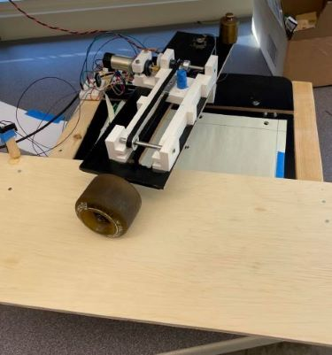
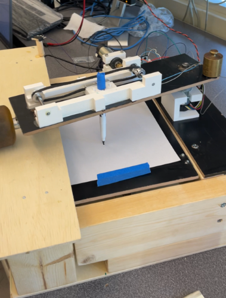
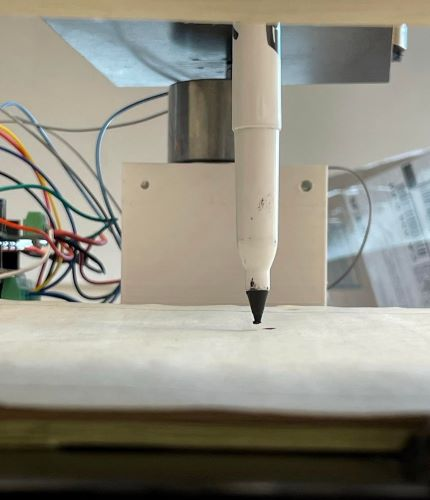
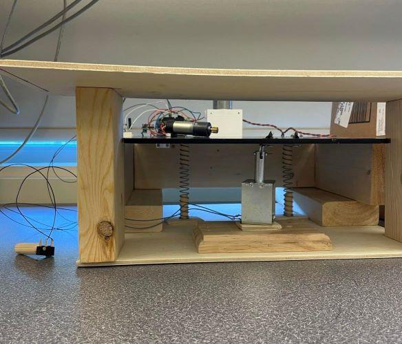
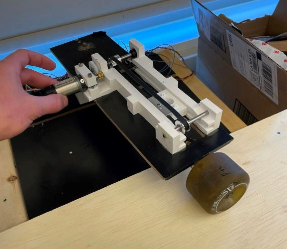

# Pen Plotter Term Project
## **Description of Project**
Our System is a 2.5 degree of freedom cylindrical Pen Plotter. The purpose of this project was to implement python cooperative multitasking into a real mechatronics system. Our system takes in an HPGL drawing and converts it into ticks for our motors to be set at. This in conjunction with the pen up and down commands allow an image to be drawn. Our system is intended to be used to draw simple shapes and objects for an area of 4.5"x11.5".  

## **Hardware Design**
Our Hardware Design is broken up into three parts: the drop down table base, the track, and the sled. The drop down table base allows us to have a half degree of freedom by being in up(pen down) or in the down position (pen up). We used a 12V continuous pull solenoid, actuated with an N-channel Mosfet with a 5V Gate to Source start voltage. This in conjuction with a flyback diode, and two 4 inch springs, allowed for our drawing surface to be dropped and not be in contact with the pen. The sled was the mover of the pen. Two 3D printed side rails created a track for our pen holder. The pen holder moved along this track being guided by 6mm GT2 timing belt that was directly mounted to the holder. The belt was driven by a 48 tooth plastic gear that was geared to the provided ME 405 bin Pittperson Gearmotors. The side rails were epoxied to a 4"x13"x0.375" piece of particle board with a slot cut through the middle of it. The conjunction of the drop down table base and the sled were through the "elbow motor". The "elbow motor" was a 131:1 12V DC motor that was clamped down to a 3D printed motor mount. This motor mount was epoxied to the top of the drop down table ledge, and the nucleo is mounted next to it. The elbow motor shaft ran through the particle board sled, and interfaced with a shaft collar epoxied to the surface. In order to allow free motion of the sled across the drawing plane, a caster wheel was epoxied to the end of the sled, opposite of the elbow motor and shaft collar. A sawed off skateboard truck provided an appropriate solution. The track for the skateboard wheel was created such that the sled would be level when moving left and right. To protect the system, two limit switches were added: one on the pen holder slider, and one on the skateboard wheel track. These two limit switches were used as zeroing points in our code.

## **Software Design**
Our system design makes use of cooperative multittasking using three main tasks, the encoder task, controller task and the motor task. First, the main program runs through the seleted hpgl file and converts the coordinate system to the encoder ticks for each one of thte motors. Then the program executes its multitasking to draw the picture from the hpgl file. The encoder tasks periodically updates the encoder positions and solenoid actuation. The controller task updates the duty cycles for each motor using a proportional only controller. The motor task enables both motors, receives the duty cycles from the controller task and applies them to each motor. Once all the points have been executed, all tasks run their termination sequence. 

## **Results**
The project went pretty well. In the end we were able to have a functioning translation of HPGL code to encoder ticks, and integrated those points into our cooperative multitasking. Our testing consisted of first translating the HPGL code into a usable size of 120 points or less. We had two main startup tests: limit switch test, to test if the limit switches are reading correctly, and actuator step response, to run the motors a specified ammount after both limit switches are pressed, and to run the solenoid to ensure the drop down table is firing correctly. Once these were run, we could begin the full system running with main.py. Testing was available to us when the epoxy on the sled shaft collar was not setting. Unfortunately, we learned the hard way about connecting limit switches and disabling motors with a direct drive system and had to reset after our system would break. Testing of the multitasking and points were completed during this setting time, with no pen on paper action however. Overall, we were able to try multiple HPGL files with our system which shows the versatility of the code.

Included Below is a link to our plotter performing a Tech Demonstration: 
https://youtu.be/C0HX3mLi9cc

## **Learning and Recommendations**
This project has multiple ways to attack the design and the software. For software, the Nucleo does not have a lot of room for memory. An HPGL file of more than 120 points of data was about the max we could use before running into memory issues. This was due to calculation of the points on the Nucleo and not on the computer. With a little more time for the project, it would be wise to potentially have the initial script run the encoder tick calculations from the HPGL file on the computer, and relay that information to the Nucleo via serial port. This would allow for more precison from point to point and a more seamless result. For our design, if it were built upon, a revisitation of how the elbow motor and the sled connect and interact would be useful for testing and repeatability purposes. Mounting the shaft collar via epoxy and having one motor as direct drive complicates testing and increases failures of the system as the motor is only supposed to move about a quarter of a turn. The sliding of the pen along the rails however functioned extremely well. Using a geared system is highly important for transsfering power and allowing repeatable testing. 

## **Additional Links**
Our CAD Repository is linked below:
https://github.com/luxinatux/Pen-Plotter-Cad-405-TP

Included Below is a link to our plotter drawing a smiley face(same one as before): 
https://youtu.be/C0HX3mLi9cc

