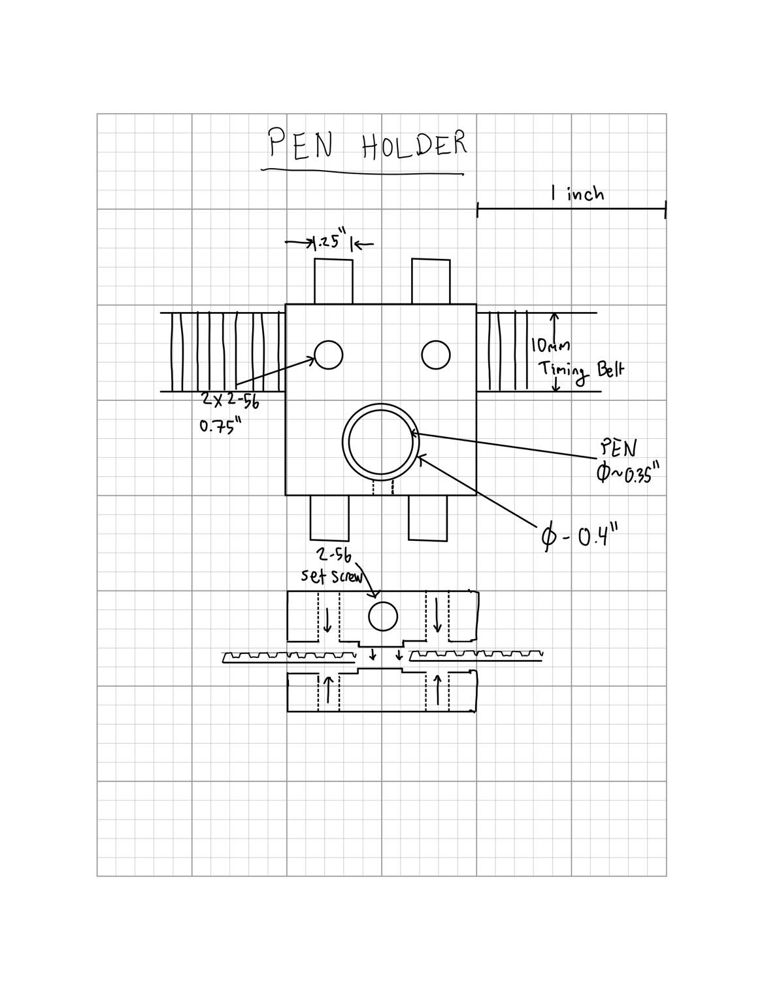
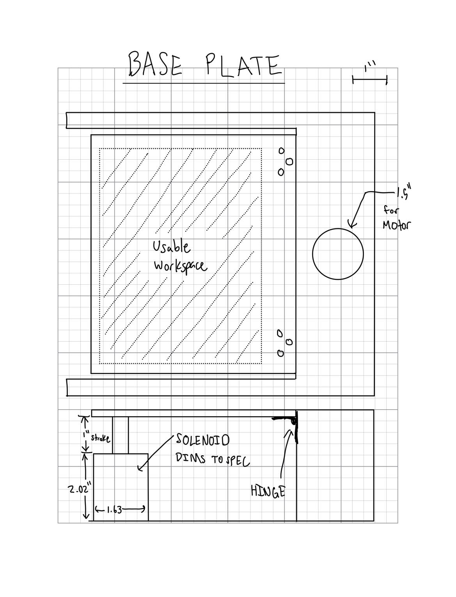
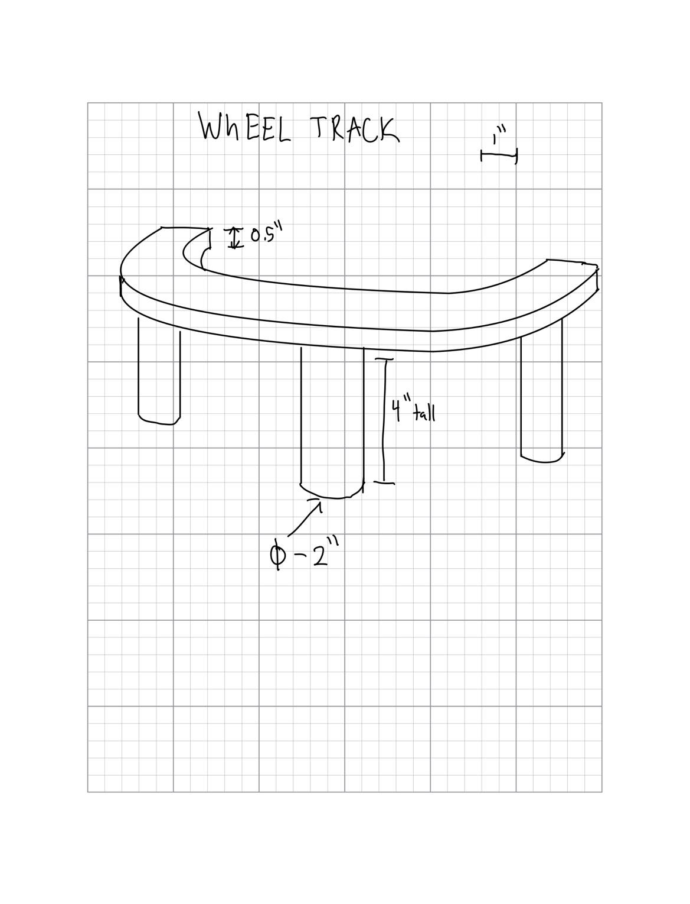

# Pen Plotter Term Project
## **Description of Proposed Project**
Our proposed system is a 2.5 axis system that will act as a pen plotter. Our proposed system is similar to the example idea where the arm rotates radially, however it is driven by the hub instead of driven by the wheel. The wheel will freely rotate about a curved platform and provide stability for the arm. The motor will be geared up to increase the precision of the radial position. Our radial movement will be controlled using a timing belt along with two timing belt driver pulleys. Our other motor will drive one of the pulleys, causing the belt to move outwards or inwards radially. The pen holder will be attached to the bottom side of the belt and will not contain the solenoid, only a mechanism to hold the pen. 

Instead of dropping the pen to write, we will be raising the edge of the platform using a solenoid placed at the far edge of the paper holder. The paper holder will be attached to a hinge that allows it to rotate out of reach of the pen. 
## **Bill of Materials**
| Qty. | Part                  | Source                | Est. Cost |
|:----:|:----------------------|:----------------------|:---------:|
|  2   | Pittperson Gearmotors | ME405 Tub             |     -     |
|  1   | Nucleo with Shoe      | ME405 Tub             |     -     |
|  1   | Purple Sharpie&trade; | Office Min&trade;     |   $1.02   |
|  1   | Timing Belt 39"       | VXB.com               |   $3.95   |
|  2   | Timing Pulley         | VXB.com               |   $18.00  |
|  1   | Linear Solenoid       | McMasterCarr.com      |   $47.42  |
|  4   | Limit Switches        | Digikey               |   $10.44  |
|  2   | Skateboard Wheels     | Lucas Skateboard      |     -     |
|  2   | Shafts (Aluminum)     |     ?                 |     -     |
| 4ish | Bearings              |     ?                 |     -     |
|  ?   | Wood                  |     ?                 |     -     |

## **Drawings**

